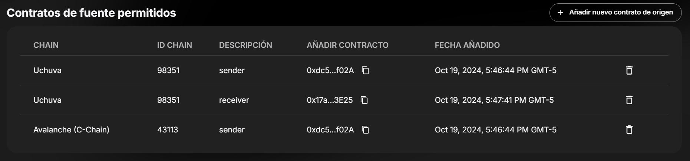
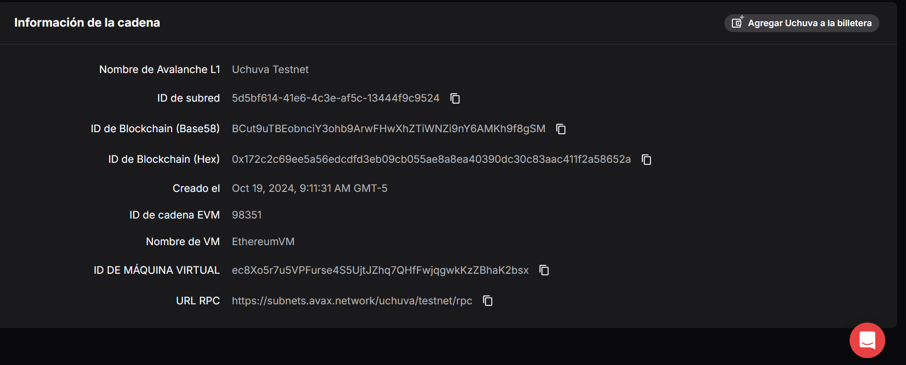

# Tutorial: Communication between Smart Contracts on Avalanche

## Objective
This tutorial outlines how to create a Layer 1 (L1) on Avacloud, deploy smart contracts that communicate with each other, and validate functionality using the Teleporter on Avalanche.

## 1. Create L1 with Active Relayer (Avacloud)
Step-by-Step Instructions
Step 1: Access Avacloud
1. Go to the Avacloud website.
2. create a new L1 on Avacloud with the following settings and validators
3. Once the L1 is created, go to the interoperability section to enable the teleporter. Once here, you need to wait for approval. After that, you must enter the allowed source contracts to interact with the contract.
 

## 2. Obtain the Blockchain ID (Hex) of the L1 Receiving the Message
1. Once you have created the L1, navigate to its configuration settings.
2. Look for and note down the Blockchain ID in hexadecimal format. This ID is necessary for sending messages to the chain.
3. Go to the details section, and at the bottom, enter the URL of the explorer. Once here, in the explorer section at the bottom, you will find the hex.
 

## 3. Create, Deploy, and Obtain Address of the Smart Contract that Receives on L1 A
1. Create the smart contract that will receive messages on L1 A. Here is an example of the code:

   ```solidity
   // SPDX-License-Identifier: Ecosystem
   pragma solidity ^0.8.18;

    import "@teleporter/ITeleporterMessenger.sol";
    import "@teleporter/ITeleporterReceiver.sol";

   contract ReceiverWinner is ITeleporterReceiver {
    ITeleporterMessenger public immutable messenger = ITeleporterMessenger(0x253b2784c75e510dD0fF1da844684a1aC0aa5fcf);
    address private winner;

    event WinnerUpdated(address newWinner);

    function receiveTeleporterMessage(bytes32, address, bytes calldata message) external {
        require(msg.sender == address(messenger), "Unauthorized TeleporterMessenger");

        address newWinner = abi.decode(message, (address));
        winner = newWinner;
        emit WinnerUpdated(newWinner);
    }

    function viewWinner() public view returns (address) {
        return winner;
    }
    }
   ```

2. Deploy the contract on L1 A using Foundry:

   ```bash
   forge create --rpc-url <L1_A_RPC_URL> --private-key $PK contracts/uchuva/receiver.sol:WinnerContract
   export RECEIVER=<ADDRESS_OF_WINNER_CONTRACT>
   ```

## 4. Create, Deploy, and Obtain Address of the Smart Contract that Sends on L1 B
1. Create the smart contract that will send messages on L1 B. Here is an example of the code:

   ```solidity
   // SPDX-License-Identifier: Ecosystem

    pragma solidity ^0.8.18;

    import "@teleporter/ITeleporterMessenger.sol";

    contract SenderGame {
    address public lastWinner;
    bytes32 destinationChainID;

    event GamePlayed(address player1, address player2, address winner);
    event WinnerSent(address winner, bytes32 messageID);

    ITeleporterMessenger public immutable messenger = ITeleporterMessenger(0x253b2784c75e510dD0fF1da844684a1aC0aa5fcf);

    function playGame(address player1, address player2, address winnerContractAddress) public {
        require(player1 != player2, "The addresses must be different.");
        require(player1 != address(0) && player2 != address(0), "Invalid addresses.");

        // Function (not secure) that chooses a winner, for production please use secure random function
        uint256 randomResult = uint256(keccak256(abi.encodePacked(block.timestamp, player1, player2))) % 2;

        address winner = randomResult == 0 ? player1 : player2;
        lastWinner = winner;

        emit GamePlayed(player1, player2, winner);

        // Send the winner to the another L1 blockchain
        sendWinnerToAnotherL1(winner, winnerContractAddress);
    }

    // Replace destinationBlockchainID with the Blockchain ID (Hex) of your L1 (Follow the DEPLOYMENT_GUIDE_AVACLOUD.md)
    function sendWinnerToAnotherL1(address winner, address winnerContractAddress) internal {
        TeleporterMessageInput memory messageInput = TeleporterMessageInput({
            destinationBlockchainID: 0x172c2c69ee5a56edcdfd3eb09cb055ae8a8ea40390dc30c83aac411f2a58652a,
            destinationAddress: winnerContractAddress,
            feeInfo: TeleporterFeeInfo({feeTokenAddress: address(0), amount: 0}),
            requiredGasLimit: 100000,
            allowedRelayerAddresses: new address[](0),
            message: abi.encode(winner)
        });

        bytes32 messageID = messenger.sendCrossChainMessage(messageInput);
        emit WinnerSent(winner, messageID);
    }

    function getLastWinner() public view returns (address) {
        return lastWinner;
    }
    }
   ```

2. Deploy the contract on L1 B using Foundry:

   ```bash
   forge create --rpc-url <L1_B_RPC_URL> --private-key $PK contracts/uchuva/sender.sol:SimpleGame
   export SENDER=<ADDRESS_OF_SIMPLE_GAME>
   ```

## 5. Execute the Sending Smart Contract
To start the game in the `SimpleGame` contract on L1 B:

```bash
export PLAYER1=<ADDRESS_OF_PLAYER_1>
export PLAYER2=<ADDRESS_OF_PLAYER_2>
cast send --rpc-url <L1_B_RPC_URL> --private-key $PK $SENDER "playGame(address, address, address)" $PLAYER1 $PLAYER2 $RECEIVER
```

## 6. Execute the Receiving Smart Contract and Validate
To verify that the `WinnerContract` has correctly received the winner's address:

```bash
cast call --rpc-url <L1_A_RPC_URL> $RECEIVER "viewWinner()(address)"
```

## ChainGo

Enter this link to use the send and receive templates that Chaingo already offers you, a platform that facilitates communication between your L1s

```bash
https://chaingo.uchuvalabs.xyz
```


## Conclusion
This tutorial provides a step-by-step approach to establishing communication between smart contracts on Avalanche using Avacloud. Make sure to adjust the addresses and specific configurations according to your implementation and environment. Good luck with your development!
